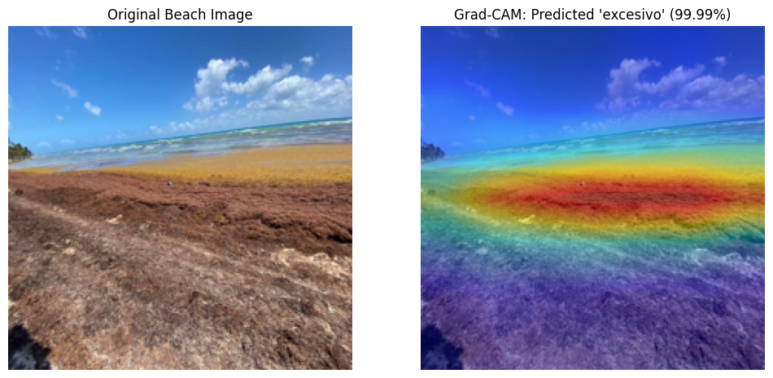
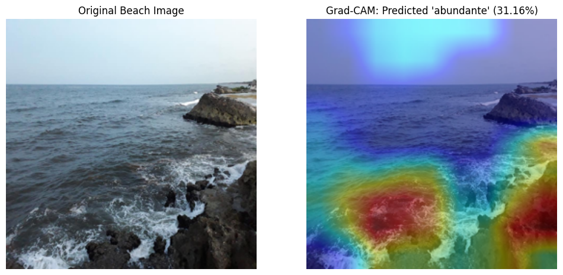

# Sargassum Influx Classification: An AI Approach to Environmental Monitoring

## Developed for the UNAM 'Macroentrenamiento en IA (MeIA 2025)' Kaggle Competition (June 2025)

### Project Overview

The Mexican Caribbean faces recurring sargassum arrivals that severely impact tourism, local ecosystems, and the built environment. This project focuses on Environmental Computer Vision, aiming to automatically estimate sargassum levels from beach imagery using Deep Learning. 
By leveraging Transfer Learning and Explainable AI (XAI), this system provides a scalable solution for local authorities and AECO (Architecture, Engineering, Construction, and Operations) firms to optimize beach cleanup logistics and resource allocation. 
The task is a multiclass, ordinal classification problem featuring five levels of sargassum presence: 
- Nada (None)
- Bajo (Low)
- Moderado (Moderate)
- Abundante (High)
- Excesivo (Very High)

### Dataset & Origin
- Source: Dataset and baseline code provided by the UNAM 'MeIA 2025' instructional team.
- Input: RGB beach images sourced from social media (Facebook/Instagram).
- Challenges: Significant class imbalance (majority "Nada/Bajo" samples) and varying image resolutions.
- Split: Stratified sampling used to maintain label distribution across Training and Validation sets.

### Technical Implementation
#### Model Architectures
Two distinct CNN architectures were benchmarked to find the balance between edge-deployment efficiency and high-accuracy classification:
- MobileNetV2 (Baseline) - Efficiency for mobile devices.
- EfficientNet-B2 (Final Model) - Higher robustness.

### Advanced Training Strategy
To improve the baseline results provided by the instructors, I implemented several advanced techniques:
- Loss Function: Switched to Focal Loss to penalize the model more heavily for misclassifying the rarer, high-impact categories ("Abundante/Excesivo").
- Optimization: Utilized AdamW with a ReduceLROnPlateau scheduler to dynamically adjust learning rates as training converged.
- Data Augmentation: Applied RandomResizedCrop, ColorJitter, and RandomPerspective to simulate different weather conditions and camera angles.
- Checkpointing: Integrated a persistent saving system in Google Colab to preserve the best model weights based on Validation F1-score.

### Interpretability
A key part of this project was validating **why** the model made its decisions. Using Grad-CAM, I compared high-confidence predictions against lower-confidence edge cases to identify areas for future optimization.

| **Case A: High-Confidence "Excesivo" (99.9%)** | **Case B: Complex Edge Case (31.1%)** |
| :---: | :---: |
|  |  |
| **Observation:** The model shows near-perfect localization on dense sargassum mats, ignoring sky and clear water. | **Observation:** The model correctly identifies the intertidal zone but shows lower confidence due to textural similarities with rocky outcrops. |
| **Verdict:** Highly reliable for automated alerting in high-density areas. | **Verdict:** Highlights a need for "hard negative" training on rocky shorelines to reduce bias. |

### Results & Output
- submission.csv: Predictions generated for the Kaggle test set.
- best_model.pth: Optimized weights for deployment.
- Classification Report: Detailed breakdown of Precision, Recall, and F1-score per class, identifying specific areas for future dataset expansion.

### Tech Stack
- Core: Python, PyTorch, Torchvision
- Analytics: Scikit-learn, Pandas, NumPy
- Visualization: Matplotlib, OpenCV, PIL
- Platform: Google Colab (GPU-accelerated training)

Author: Sebastian Méndez

### Acknowledgments
This project was developed as part of a Kaggle competition during the 'MeIA 2025' intensive course at UNAM (June 2025). I would like to thank the instructional team for providing the initial sample code and the curated dataset used in this research.
